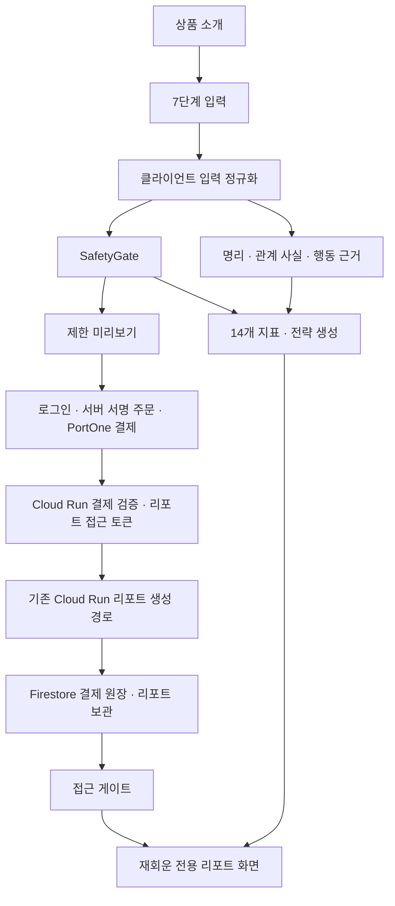
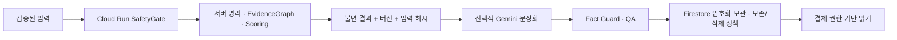

# MZ큐피트 재회운 아키텍처

> 상태 기준일: 2026-07-21
> Source status update (2026-07-21): the Cloud Run report path now receives and
> validates the versioned reunion intake and stores the generated
> `reunionStrategy` with the canonical report. Production redeployment remains P0.
> 이 문서는 현재 저장소의 구현을 설명한다. 운영 배포 완료나 외부 전문가 승인을 의미하지 않는다.

## 1. 현재 구현 범위

재회운은 기존 운월당 React/Vite 프런트엔드, Cloud Run API, Firestore 결제 원장·리포트 보관 구조 위에 추가된 전용 세로형 기능이다. 데이터베이스를 Supabase 등으로 교체하지 않고 **Firestore를 유지**한다.

현재 전용 경로는 다음과 같다.

- `/detail/love-reunion`: 상품 소개
- `/form/love-reunion`: 7단계 관계·안전·출생정보 입력
- `/preview/love-reunion`: 제한 미리보기와 결제 진입
- `/report/love-reunion`: 접근 권한 확인 후 전체 리포트

전용 도메인 코드는 `src/lib/reunion`에 있으며 다음 레이어로 분리되어 있다.

| 레이어 | 현재 책임 | 사실 상태 |
| --- | --- | --- |
| Intake | 입력 스키마, 관계 사실, 질문, 준비도, 안전 신호 | 구현됨 |
| SafetyGate | 분석·연락 가능 여부를 최우선 판정 | 구현 및 단위 테스트 있음 |
| Manse/Saju | 기존 절기 만세력·명리 엔진 호출 | 내부 규칙·회귀 검증, 외부 명리 전문가 감수 전 |
| Ziwei | 자미두수 | 미구현, `UNVERIFIED`, 표시·점수·시기에서 미사용 |
| EvidenceGraph | 명리·관계 사실·행동·안전·한계 근거 연결 | 구현됨 |
| Scoring | 14개 지표를 각각 계산 | 구현됨. 확률이 아님 |
| Strategy | 3가지 선택 비교, 최대 3개 연락 구간, 메시지·응답 트리, 30/90일 계획 | 구현됨. SafetyGate가 허용할 때만 제공 |
| Report QA | 근거 ID, 반대 근거, 안전 우선, 금지 단정 문구 등을 점검 | 런타임 감사 및 단위 테스트 있음 |

## 2. 현재 데이터 흐름

중요한 현재 경계는 다음과 같다.

1. 재회운 전용 `ReunionReport` 계산은 현재 프런트엔드 번들에서 실행된다.
2. 운영 결제·권한·기존 리포트 생성·아카이브는 Cloud Run과 Firestore가 담당한다.
3. 따라서 결제 접근 제어는 서버 권위지만, 재회운 전용 지표 자체는 아직 서버가 서명한 권위 결과가 아니다.
4. 상용 출시 전 재회운 계산을 Cloud Run 서버 경로로 옮기고, 입력 해시·룰 버전·결과를 결제 권한에 바인딩해야 한다.
5. 로컬 개발의 loopback 미리보기 우회는 `DEV` 환경에서만 허용하며 운영 권한으로 간주하지 않는다.

## 3. 계산 파이프라인

1. 입력을 `ReunionIntakeData`로 정규화한다.
2. 성인·동의·정보 사용 권한과 위험 신호를 SafetyGate에서 먼저 확인한다.
3. 허용된 경우 기존 절기 만세력·명리 엔진으로 본인 원국과, 정보가 있을 때 상대 원국·정적 궁합을 계산한다.
4. 자미두수는 계산하지 않는다.
5. 명리, 사용자가 입력한 관계 사실, 관찰 가능한 행동, 안전 정책, 시스템 한계를 EvidenceGraph 노드로 만든다.
6. 14개 지표마다 지지 근거와 반대 근거를 연결한다.
7. SafetyGate 상태에 따라 지표·연락 구간·메시지·응답 트리를 제공하거나 보류한다.
8. 런타임 감사가 안전 우선, 지표 분리, 근거 무결성, 반대 근거, 자미두수 제외, 단정 문구 차단을 검사한다.

LLM은 재회운 지표·SafetyGate·만세력·시기를 계산하거나 수정하는 주체가 아니다. 향후 Gemini를 연결하더라도 서버가 고정한 사실과 허용된 근거 범위 안에서 문장 표현만 다듬어야 하며, 결과는 다시 fact guard와 QA를 통과해야 한다.

## 4. Firestore 현재 구조

Firestore Native mode와 기존 두 컬렉션을 유지한다.

### `portonePaymentConfirmations`

- 결제 확인과 사용자 귀속 권한
- `reportInputHash`로 결제 1건과 입력을 바인딩
- 리포트 생성 상태, 임대 잠금, 시도 횟수
- 완료된 기존 서버 리포트 JSON 캐시

### `reportArchives`

- `userId`, `archiveId`, `orderId`, `productId`
- 고객 표시명, 제목, 결제 수단, 생성 시각
- 전체 보관 항목을 문자열화한 `entryJson`
- 문서 ID는 사용자 ID와 아카이브 ID를 해시해 생성

현재는 재회운 전용 정규화 컬렉션, 필드별 민감도 분류, 서버 권위 `ReunionReport` 스키마, 삭제 tombstone 또는 보존 만료 필드가 없다. `entryJson`에 무엇이 들어가는지 출시 전 데이터 인벤토리로 확정해야 한다.

## 5. 인증·권한 경계

- 주문 금액과 상품 ID는 Cloud Run 카탈로그에서 결정한다.
- 결제 확인은 로그인 사용자, 서명된 주문 claim, PortOne 결제 상태·금액·통화·스토어를 검증한다.
- 운영 리포트 생성은 결제에 바인딩된 단기 bearer token을 요구한다.
- 아카이브 저장도 사용자 token과 해당 리포트 token을 요구해야 한다.
- 보고서·사용자·관리자 서명 secret은 서로 다른 Secret Manager 값이어야 한다.
- 서버 secret을 Vercel의 `VITE_*` 변수에 넣지 않는다.

## 6. 상용화 전 P0

다음 항목이 끝나기 전에는 “운영 준비 완료”로 표시하지 않는다.

1. **운영 Cloud Run 구버전 재배포**: 현재 운영 revision이 저장소 최신 코드와 일치하지 않는 감사 결과가 있으므로 최신 검증 commit으로 재빌드·재배포하고 revision/commit을 기록한다.
2. 재회운 전용 계산을 Cloud Run 서버 권위 경로로 이전하고 입력 해시, `reunion-report-v1.0.0`, `reunion-policy-2026.07`, 결과를 함께 고정한다.
3. Firestore 보관 데이터 최소화, 보존 기간, 사용자 조회·삭제 API를 구현한다.
4. 실제 결제 취소·환불 상태 동기화와 운영자 절차를 구현한다.
5. 전문가 신청·배정·검수·수정 이력 워크플로를 구현하기 전에는 “전문가 검수” 또는 시그니처 서비스를 판매·표시하지 않는다.

## 7. 배포 후 목표 구조

프런트엔드는 이 결과를 표현하고 사용자 입력을 돕는 역할만 맡는다. 점수, 안전 판정, 연락 허용 여부를 클라이언트가 최종 결정하지 않게 한다.
